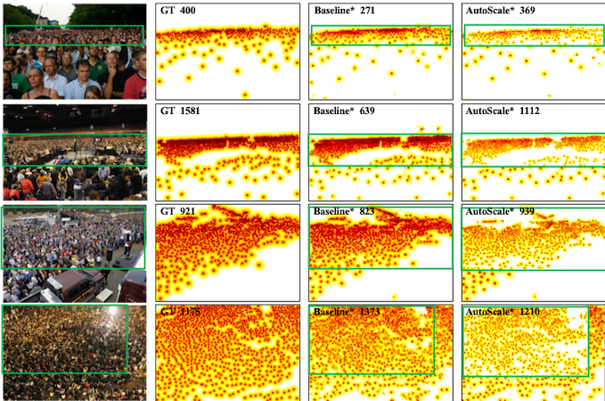
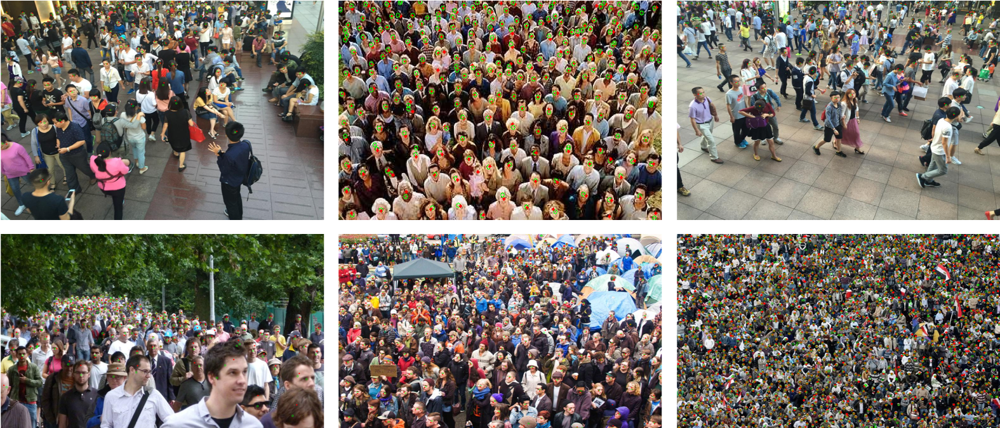

# AutoScale_localization
* An officical implementation of AutoScale localization-based method, you can find regression-based method from [here](https://github.com/dkliang-hust/AutoScale_regression). 
* [AutoScale](https://arxiv.org/abs/1912.09632) proposes a simple yet effective Learning to Scale (L2S) module to cope with significant scale variations in both regression and localization.<br />

# Structure
```
AutoScale_localization
|-- data
|   |-- ShanghaiTech                         
|   |-- UCF_QNRF   
|-- model             # model path
|   |-- ShanghaiA          
|   |-- ShanghaiB               
|   |-- UCF_QNRF   
|-- README.md       # README
|-- centerloss.py           
|-- config.py          
|-- dataset.py       
|-- find_contours.py           
|-- fpn.py         
|-- image.py
|-- make_npydata.py
|-- rate_model.py
|-- val.py        
```

# Visualizations
##Some localization-based results.


##Result of detected person locations
Red points and green circles are the ground-truth and predicted locations, respectively.


# Environment
python >=3.6 <br />
pytorch >=1.0 <br />
opencv-python >=4.0 <br />
scipy >=1.4.0 <br />
h5py >=2.10 <br />
pillow >=7.0.0

# Datasets
For ShanghaiTech
* Download ShanghaiTech Dataset from [Baidu-Disk](https://pan.baidu.com/s/1nuAYslz) <br />
* Move ShanghaiTech to ./data
* Create Directories, final data path structure looks like this:<br />
```
|-- data
|   |-- ShanghaiTech
|   |   |-- part_A_final
|   |   |   |-- train_data
|   |   |   |   |-- images
|   |   |   |   |-- ground_truth
|   |   |   |   |-- gt_distance_map
|   |   |   |-- test_data
|   |   |   |   |-- images
|   |   |   |   |-- ground_truth
|   |   |   |   |-- gt_distance_map
|   |   |-- part_B_final  
|   |   |   |-- train_data
|   |   |   |   |-- images
|   |   |   |   |-- ground_truth
|   |   |   |   |-- gt_distance_map
|   |   |   |-- test_data   
|   |   |   |   |-- images
|   |   |   |   |-- ground_truth
|   |   |   |   |-- gt_distance_map           
|   |-- UCF_QNRF 
```
* Generate target <br />
 ```cd ./data/``` run ```python Distance_generate_Sh.py```<br />

For UCF-QNRF
* Download UCF-QNRF Dataset from  [Google-Drive](https://drive.google.com/file/d/1fLZdOsOXlv2muNB_bXEW6t-IS9MRziL6/view)
* Move UCF-QNRF to ./data
* Create Directories, final data path structure looks like this:<br />
```
|-- data          
|   |-- UCF_QNRF
|   |   |-- train_data_1920
|   |   |   |-- images
|   |   |   |-- gt_distance_map
|   |   |-- test_data_1920
|   |   |   |-- images
|   |   |   |-- gt_distance_map
|   |   |-- Train
|   |   |-- Test
|   |-- SHanghaitech
```
* Generate target <br />
 ```cd ./data/``` run ```python Distance_generate_QNRF.py```<br />


# Model
* ShanghaiA [link](https://pan.baidu.com/s/13dWGc8-0T_MTkyDD14U2nQ), passward : ban1
* ShanghaiB [link](https://pan.baidu.com/s/1cs4Txb6BoobMTB7VKsjfmQ), passward : a3g2
* UCF-QNRF  [link](https://pan.baidu.com/s/1atLZmCQmdxv-DFnltCSLtA), passward : v8zk


# Quickly test
* Download Dataset and Model
* Generate images list, run ```python make_npydata.py  ```
* Test <br />
```python val.py  -- test_dataset UCF-QNRF  --pre ./model/UCF-QNRF/model_best.pth.tar```<br />
```python val.py  -- test_dataset ShanghaiA  --pre ./model/ShanghaiA/model_best.pth.tar```<br />
```python val.py  -- test_dataset ShanghaiB  --pre ./model/ShanghaiA/model_best.pth.tar```<br />
More config information are  provided in ```config.py  ```


# References
If you are interested in AutoScale, please cite our work:
```
@article{xu2019autoscale,
  title={AutoScale: Learning to Scale for Crowd Counting},
  author={Xu, Chenfeng and Liang, Dingkang and Xu, Yongchao and Bai, Song and Zhan, Wei and Tomizuka, Masayoshi and Bai, Xiang},
  journal={arXiv preprint arXiv:1912.09632},
  year={2019}
}
```
and
```
@inproceedings{xu2019learn,
  title={Learn to Scale: Generating Multipolar Normalized Density Maps for Crowd Counting},
  author={Xu, Chenfeng and Qiu, Kai and Fu, Jianlong and Bai, Song and Xu, Yongchao and Bai, Xiang},
  booktitle={Proceedings of the IEEE International Conference on Computer Vision},
  pages={8382--8390},
  year={2019}
}
```


